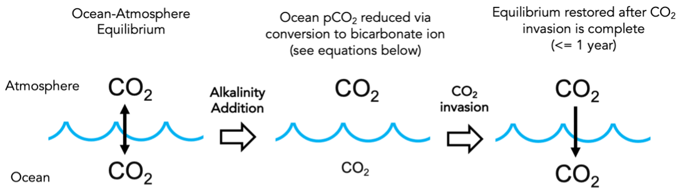
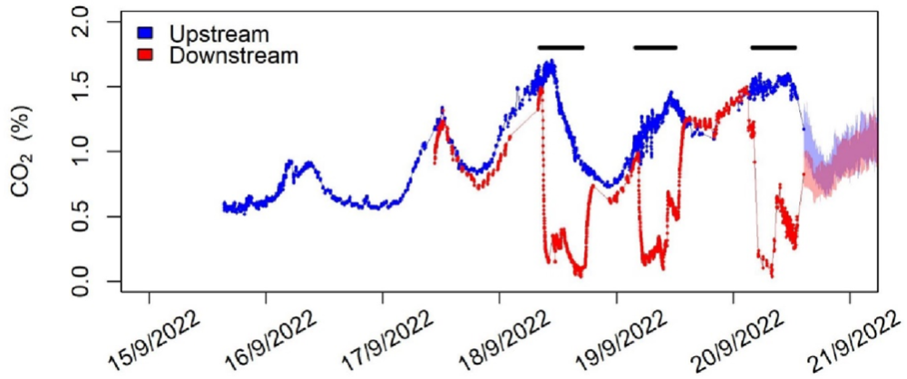
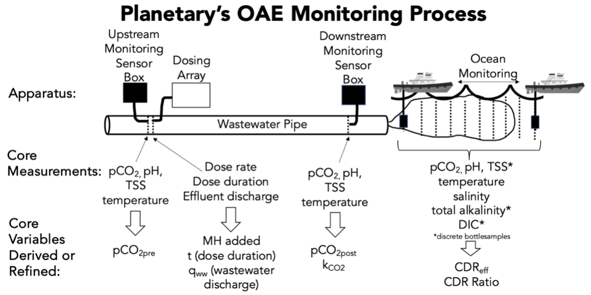
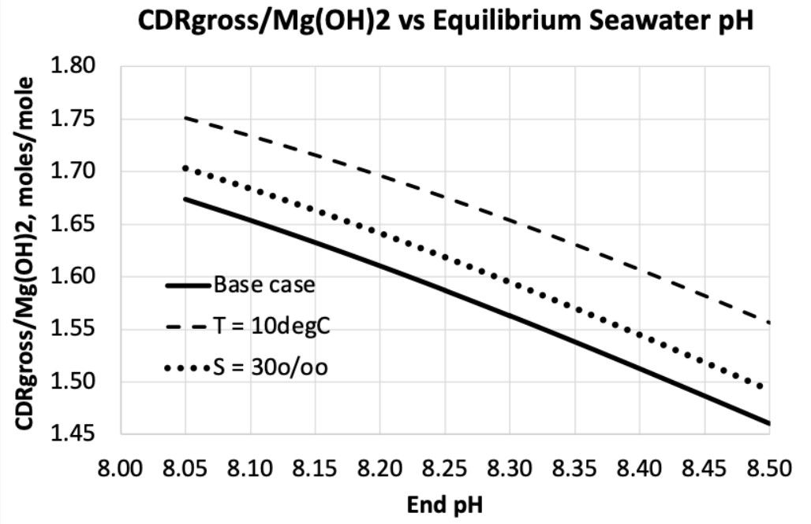
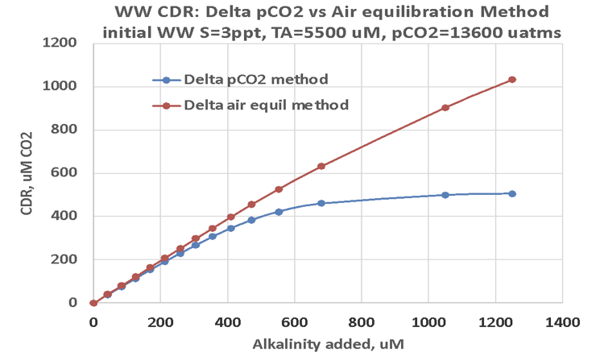
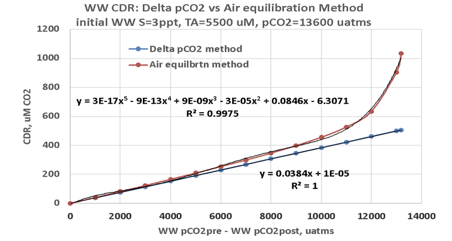

## Version History

This document is a working draft of Planetary’s approach to the Measurement, Reporting, and Verification (MRV) of carbon dioxide removal via ocean alkalinity enhancement and builds on an earlier Version 1.0. The document will be refined and improved as both Planetary and the global oceans community learn through continued research and experimentation in the laboratory and in the field. To date, the history of this MRV Protocol is as follows:

[Version 1.0](https://github.com/Planetary-Technologies/MRV/releases/latest) - Completed August 12th, 2022. Agreed upon by Planetary and Shopify in advance of Planetary’s initial methods test conducted in September, 2022.

[Version 2.0](https://github.com/Planetary-Technologies/MRV/releases/tag/v2.0) - Present version as of date listed, incorporating results from continued laboratory experimentation and learnings from a 3-day methods test conducted in the UK in September, 2022. Also, advancing the scope of our emissions accounting protocol.

## Background

Following on from a short method test in 2022, Planetary intends to begin longer-term field trials in 2023 to demonstrate net carbon dioxide removal (CDR) from the atmosphere through ocean alkalinity enhancement (OAE). A robust, science-based MRV protocol that is agreed to by both provider (Planetary) and the customer (in the first instance, Shopify), and supported by ocean science, is required to ensure that the greenhouse gas removals (Removals) are appropriately measured, quantified, monitored, accounted for, and permanently retired. CO₂ removals will be verified by independent 3rd parties to ensure their compliance with this MRV protocol.

Planetary’s current OAE approach involves the addition of fine magnesium hydroxide particles (Mg(OH)2; henceforth MH), in slurry form, to wastewater, or other industrial outfalls that discharge into the ocean. As MH is a CO₂-reactive form of alkalinity, its addition to water results in the simultaneous increase in pH, and the conversion of dissolved CO₂ into bicarbonate and carbonate ions. The fundamental chemistry of this reaction in the ocean is illustrated in Figure 1. The resulting reduction in the partial pressure of CO₂ (pCO₂) in seawater either:

- under saturates the seawater in CO₂ relative to air, thus forcing a CO₂ flux from the air to the ocean, or
- in waters that are supersaturated in CO₂ (such as ocean upwelling areas or around wastewater outfalls), lowers the water’s pCO₂ such that loss of biogenic CO₂ to air is reduced or avoided.

CDR is thus achieved by either ingassing CO₂ from air to ocean or by reducing CO₂ outgassing to the air. In either case, CO₂ is securely stored in the ocean while alkalinity, carbon content, and pH are raised. Of note, direct measurement of these parameters becomes increasingly difficult as the process progresses due to rapid dilution of the alkalinized discharge and the long air-sea CO₂ equilibration time, as further discussed below.

Various site-specific inefficiencies and uncertainties in this basic process need to be accounted for in order to derive the net CDR effected for a given alkalinity addition, while CO₂ emissions associated with Planetary’s end-to-end OAE process, determined by Life Cycle Analysis (LCA), also need to be subtracted to determine net CDR.

<figure>
  
  <figcaption>
    **Figure 1**  
    Basic chemistry of OAE by MH addition
  </figcaption>
</figure>

$$
\tag{Full Equation} Mg^{2+} + 2OH^- + 1.65(CO_{2aq}) \rightarrow Mg^{2+} + 1.48(HCO_3^-) + 0.17(CO_3^{2-}) + 0.18(OH^-)
$$

Coefficients vary with pH, T, S and P. Values shown for pH = 8.1, 20°C, 35ppt, 10dB

$$
\tag{Simplified Equation} OH^- + CO_2 \rightarrow HCO_3^-
$$

In the case of municipal wastewater, the intense microbial respiration taking place in the treatment process, fuelled by waste organic matter, means that these discharges are very highly supersaturated in CO₂ relative to air. Thus, by adding alkalinity to these streams there is significant potential for CO₂ removal to occur in the pipe, before the alkalinized wastewater is delivered to the ocean. This in turn avoids biological CO₂ emissions that would otherwise occur in the absence of alkalinity addition.

As originally described in [V1.0](https://github.com/Planetary-Technologies/MRV/releases/tag/v1.0), wastewater outfalls present an opportunity to quantify this biogenic CDR component by conducting on-land monitoring to calculate the removal occurring in-pipe. V2.0 updates the way in which this component is reflected in the overall CDR calculation.

## Calculation of Net CDR

As illustrated in Figure 1, the gross quantity of dissolved CO2 (CO2aq) that is removed from seawater and converted to bicarbonate (HCO3-) and carbonate (CO32-) ions is determined by the stoichiometric ratio between CO2 consumed and MH added. This ratio is termed the "CDR ratio", and is shown in the figure as 1.65 moles CO2/moles MH (equivalent to 1.25 tCO2/tMH), keeping in mind that this ratio varies with the pH, temperature (T) and salinity (S) attained following dilution in the ocean (see [Appendix 1](#appendix-1-detailed-discussion-of-factors-affecting-cdr)). Fundamentally, the maximum theoretical gross CDR achievable by alkalinity addition can be calculated by applying this ratio to the mass of MH added:

$$
\tag{1} CDR_{gross} = MH_{added} \times CDR_{ratio}
$$

The MH added is directly measured using the concentration of MH present in the slurry times the volume of slurry added to the outfall. The rate and duration of slurry dosing are closely monitored, and the chemical conditions in the wastewater pipe and receiving ocean waters are measured to determine an appropriate CDR ratio. From the gross CDR calculated in this way, net CDR can then be calculated as:

$$
\tag{2} CDR_{net} = CDR_{gross} \times (CDR_{eff} - CDR_{hback}) - LCA_{emiss}
$$

CDReff refers to the fraction of CDRgross that is actually realized in the ocean. Specifically, it is the fraction of the CDRgross achieved within 1 year of the addition of alkalinity for a specific location (see [Appendix 1](#appendix-1-detailed-discussion-of-factors-affecting-cdr)). It reflects the fact that air-sea exchange of CO2 requires that added MH dissolves in surface waters and the resulting CO2-altered water remains in the surface mixed layer until pCO2 equilibrium between air and seawater is restored. The present approach described here relies on numerical modelling to assess this efficiency (further discussed in [Appendix 1](#appendix-1-detailed-discussion-of-factors-affecting-cdr)). Improving our ability to more directly measure this type of efficiency remains a priority across many CDR approaches.

CDRhback is a holdback factor that further, fractionally reduces CDRnet, the reduction reflecting maturity and degree of verification of the CDRgross modeling/calculation for individual deployment sites. A CDRhback of 0.15 is initially assumed and the requirements to progressively reduce this factor, and considerations to refine its calculation further, are discussed in [Appendix 1](#appendix-1-detailed-discussion-of-factors-affecting-cdr).

LCAemiss is the tonnes of CO2 emitted in the production, transportation, and distribution of the total MH mass used in the operation, discussed further in [Section 4](#emissions-accounting-methodology), LCA Methodology.

Equation 2 represents Planetary's fundamental approach to calculating CDRnet. However, as noted above, at sites where MH is added to CO2-supersaturated wastewater prior to its discharge, CO2 removal will start within the wastewater pipe, presenting an opportunity to enhance measurability by directly determining the contribution to CDRgross from the reduction of wastewater biogenic CO2 outgassing. The potential of this approach was demonstrated in a recent wastewater monitoring test, illustrated in Figure 2. The data highlights that this wastewater CDR contribution to CDRgross can be determined from the directly measured reduction in wastewater pCO2 resulting from MH addition.

In such cases, CDR occurs in two stages, and CDRgross can be expressed as:

$$
\tag{3} CDR_{gross} = CDR_{ww} + CDR_{ocean}
$$

to reflect biogenic CDR from the wastewater (CDRww) and additional CDR
occurring purely in the ocean (CDRocean) when the remaining unconsumed
MH is discharged.

<figure>
  
  <figcaption>
    **Figure 2**  
    %CO2 differences in a wastewater pipe measured upstream (blue) and
    downstream (red) of MH addition. Black horizontal lines indicate the periods
    of MH addition during the 3-day test. pCO2 is approximately equal
    to %CO2 x 1000 μatms/% at 1 atm total pressure. Figure from Kitidis
    et al. (2023).
  </figcaption>
</figure>

Based on the results shown in Figure 2, a measurable component of
CDRww can be calculated as:

$$
\tag{4} CDR_{ww} = (pCO_{2_{pre}} - pCO_{2_{post}}) \times k_{CO2} \times q_{ww} \times t
$$

where CDRww represents tonnes CO2 removed within the wastewater pipe after MH addition and before reaching the downstream monitoring point. pCO2pre and pCO2post (µatm) are the wastewater pCO2 measured prior to and downstream of the alkalinity addition respectively. kCO2 is the temperature- and salinity-dependent CO2 solubility constant (in this case, in units of tonnes CO2/µatm/m3), qww is the discharge rate of wastewater (m3/hr), and t is the duration of the alkalinity addition (hours). Depending on the location of the downstream monitoring point, additional wastewater CDR may occur in-pipe between this point and the ocean discharge.

However, as described in [Appendix 1](#appendix-1-detailed-discussion-of-factors-affecting-cdr) further chemical modeling indicates that Equation 4 yields an underestimate of total CDRww, especially at high (pCO2pre - pCO2post) values as seen in Figure 2. The basic reason for this underestimate is that Equation 4 only accounts for CDRww by measuring CDR (or CO2 depletion) in a closed system (the pipe). The total CDRww benefit must be determined by differencing i) the total dissolved inorganic C in the unalkalized wastewater and ii) the total C left in the unalkalized wastewater when equilibrated at the pCO2 attained by alkalization. That difference is the loss of C from wastewater to the atmosphere that is avoided by the addition of a given quantity of alkalinity. Consequently, this modified CDRww term is derived from measured (pCO2pre - pCO2post) using a polynomial equation as shown in [Figure A1.3 in Appendix 1](#cdr-1).

## Emissions Accounting Methodology

### System Boundary

In order to calculate the net CO2 removal inherent in an OAE process, the boundaries of the system under consideration must first be defined. Planetary adapts the United States Environmental Protection Agency (EPA, 2022) scope language in order to maintain a system boundary and accounting scheme specific to each project site.

Scope 1 - Direct, Project Emissions: _"..direct greenhouse (GHG) emissions that occur from sources that are controlled or owned by an organization (e.g., emissions associated with fuel combustion in boilers, furnaces, vehicles)..."_

Scope 2 - Indirect, Upstream Emissions: _"...indirect GHG emissions associated with the purchase of electricity, steam, heat, or cooling and are a result of the organization's
energy use."_

Scope 3 - Indirect, Upstream and Downstream Emissions: _".
.. all indirect emissions (not included in Scope 2) that occur in the value chain of the reporting company, including both upstream and downstream emissions."_

### CO2 Equivalents

Planetary recognizes that while the CDR credit nomenclature is often specific to carbon dioxide, project activities may generate other warming gases classified as GHG's (ex. methane and nitrous oxide). Wherever possible, Planetary will convert and report these as CO2eq.

### Project Emissions

Using these definitions, the predicted project emissions categories are
detailed here.

**Scope 1**:

- Onsite emissions from running generators for our dosing systems and onsite vehicle activity

**Scope 2**:

- Purchased/borrowed energy from an outfall facility that comes from fossil fuels or purchased electricity to run project activities

**Scope 3**:

- Alkaline feedstock embedded emissions (see below)

- Embedded emissions in our pumps, hoses, tanks, electrical equipment (amortized over the product lifespan)

- Business travel required specifically for the project activity

- Waste generated in our operations

- Any additional capital goods (amortized over the product lifespan)

- Any emissions generating services or goods used while on site

Planetary is actively engineering and assembling many of the components and resources required to successfully achieve its first project deployments. LCA will be fully documented and accounted for including these emissions as part of the verification of net CDR.

### Alkaline Feedstock Embedded Emissions

MH production and transportation is expected to be the largest emissions source. This includes mining, processing, treatments, transportation, as well as dosing of the alkalinity.

MH production can be accomplished through a number of different pathways, which fall into five broad categories: Mined, Brine, Electrolytic, Leached, and Calcined. Planetary has explored each of these pathways and determined that achieving net CDR is possible from either the individual pathway or a blend of these. The embedded emissions are calculated from cradle to grave on a project-by-project basis using industry standard LCA calculations.

## Dosing, Measurement and Monitoring

In order to verify Planetary's CDR, it is necessary to measure a set of core chemical and physical parameters before, during, and after alkalization, and use the resulting data set to calculate all the core variables in the fundamental CDR equations described above. These raw measurements, and a schematic illustrating the proposed monitoring setup for wastewater discharge, are shown below.

<figure>
  
  <figcaption>
    **Figure 3**  
    Schematic showing the layout of Planetary's monitoring program, the measurements
    made at each location, and the resulting parameters required for calculation
    of CDRgross. TSS is total suspended solids.
  </figcaption>
</figure>

In order to appropriately generate carbon removal credits, this measurement plan must expand to account for positive and negative emissions across the entire OAE process. As such, the table below summarizes the measurements to be conducted and frequency of those measurements.

<table>
  <thead>
    <tr>
      <th>Step</th>
      <th>Measurement</th>
      <th>Frequency</th>
    </tr>
  </thead>
  <tbody>
    <tr>
      <td>LCA of Alkalinity</td>
      <td>Provided by supplier</td>
      <td>Upon new source and every year</td>
    </tr>
    <tr>
      <td>LCA of Transportation to Site</td>
      <td>
        Bill of lading, distances and mode using standard emissions factors to
        derive
      </td>
      <td>LCA Per load</td>
    </tr>
    <tr>
      <td>LCA of Dosing System</td>
      <td>LCA calculation per LCA section</td>
      <td>Upon installation or modification of dosing setup</td>
    </tr>
    <tr>
      <td>Dose added</td>
      <td>Dosing system flow rate x slurry concentration</td>
      <td>Continuous</td>
    </tr>
    <tr>
      <td>
        CDRww
      </td>
      <td>
        pCO2 pre-addition - pCO2 post-addition
      </td>
      <td>Continuous</td>
    </tr>
    <tr>
      <td>
        CDReff
      </td>
      <td>
        Derived from numerical simulations of effluent dispersion and regional
        oceanographic conditions
      </td>
      <td>
        Model re-validated with ocean sensing and DIC/TA spot measurements every
        year
      </td>
    </tr>
    <tr>
      <td>CDR ratio</td>
      <td>
        Point of discharge CTD sensor & pH measurements applied to CO2SYS model
      </td>
      <td>Every 3 months</td>
    </tr>
    <tr>
      <td>Permit Compliance</td>
      <td>TSS & pH sensor</td>
      <td>Continuous</td>
    </tr>
  </tbody>
</table>

Ideally, the ocean measurement protocol would determine the seawater CO2 undersaturation relative to air resulting from hydroxide addition, and the subsequent increase in seawater DIC as atmospheric CO2 invades. However, direct measurement of an increase in seawater DIC over the entire volume of seawater affected is not currently possible. This is due to:

- the time and space scales involved,
- the continuous and significant dilution of the added alkalinity and affected seawater,
- the natural background variability of seawater chemistry, and
- the limitations of measurement precision and accuracy.

As a result, beyond areas where an increase in seawater DIC is measurable, well-validated ocean models will be used to determine the amount of CDR achieved through OAE.

## Additional Considerations

### Consideration and Monitoring of Ecological Safety

Ecological safety cannot be guaranteed for any human activity that intersects the natural world, including alkalinity addition, and rigorous peer-reviewed studies will be required to identify and mitigate any potential ecological concerns surrounding these activities. As stated in Planetary's published [code of conduct](https://www.planetarytech.com/projects/codeofconduct/), a strong understanding of any environmental impacts, both positive and negative, is the primary measure of success. In turn, the Planetary team is dedicated to ensuring, to the greatest extent possible given current knowledge, that ecological risks are minimized.

Most important among these safety considerations is Planetary's choice of MH as the alkalinity source. MH is not classified as dangerous under the Workplace Hazardous Materials Information System (WHMIS) nor is it classified as persistent, bio-accumulative or toxic under the Environmental Protection Agencies Toxic Release Inventory List or Toxic Substances Control Act. Perhaps most importantly, MH is of low toxicity to aquatic organisms, with published limits greatly exceeding any concentrations Planetary is aiming to disperse into the ocean ([https://beta.lakeland.edu/AboutUs/MSDS/PDFs/3675/Magnesium-Hydroxide-Millipore-Sigma-1-15-2020.pdf](https://beta.lakeland.edu/AboutUs/MSDS/PDFs/3675/Magnesium-Hydroxide-Millipore-Sigma-1-15-2020.pdf)).

In addition, the critical characteristic of MH that greatly limits its potential environmental impact is its slow dissolution kinetics (i.e., its low solubility). Slow MH dissolution means that general dilution of an alkalinized effluent in the marine environment will greatly outpace the chemical changes induced by the MH addition. The key example for this is pH, an important environmental quality standard (EQS) applicable to alkalinized discharges. The relatively slow dissolution kinetics of MH in seawater prevent rapid pH rises at the dosing location, after which rapid dilution with ambient seawater will keep pH well within safe limits. This has been confirmed by controlled experimentation at pool-scale (Dalhousie Aquatron), where 4 probes located at differing close proximities (1.5 m-13 m) from a pipe dosing saturated MH slurry measured maximum pH increases of 0.13-0.32 units.

Finally, in addition to these inherent mitigation factors, close monitoring and control of alkalinity dosing rates alongside monitoring of important ecological parameters, such as pH and total suspended solids (TSS), will further ensure permit limits are strictly adhered to and environmental impact is minimized. Alkalinity dosing rates will be monitored constantly, particularly during trial additions, using a flowmeter downstream of a highly tunable pump. In the ocean and, whenever possible, in the pipe downstream of the addition point, pH measurements will be monitored regularly. Furthermore, when logistically feasible, benthic surveys to quantify marine community composition, physical habitat structure, sediment composition, and localized marine environmental health monitoring will be conducted. These surveys and monitoring initiatives are designed to determine any potential ecological response to OAE. This way, any potential concerns that arise can be addressed immediately by the scientific team to remedy any potential impacts.

Planetary is also developing technology whereby a feedback loop within a central computing system allows for environmental data collected downstream (i.e. pH and/or TSS within the effluent, or potentially from a ship) to automatically tune the dosing rate. For example, if in-pipe pH measured downstream exceeds a given threshold near the permitting limit (typically 8.5), dosing would automatically decrease or cease until the pH drops accordingly.

### Considering Benefits: Restorative Impact

It is important to keep in mind the potential ecological benefits of alkalinity addition, namely its restorative chemical impact. OAE has been shown to enhance calcification rates in coral reef ecosystems (see Albright et al., 2016), although more research is needed to build on this conclusion. Such research is underway in partnership with Planetary, with the aim of assessing whether OAE leads to quantifiable increases in coral resilience to bleaching.

Monitoring this impact will be done predominantly using pH and carbonate saturation state. Specifically, mapping the magnitude and spatial extent of elevated pH (similar to mapping of pCO2 described above) will quantify the extent to which alkalinity addition has effectively countered ocean acidification in the local environment. Also, using bottle samples of dissolved inorganic carbon and alkalinity, we anticipate measuring localized increases in the calcite and aragonite saturation states (Ωcalcite, Ωaragonite, a parameter which describes the extent to which seawater is corrosive to (Ω \< 1) or preservative of (Ω \> 1) carbonate shell-forming organisms. Subsequently, these data will also be used to validate models that predict the extent to which pH and carbonate saturation states are increased both locally and downstream of the addition site.

## Permanence of Sequestration

The mean residence time of alkaline dissolved carbon (bicarbonate and carbonate ions charged-balanced by cations other than H+) in the ocean is about 105 yrs, based on the annual input of alkaline C from rivers (0.3 GtC/yr), the alkaline pool of dissolved alkaline C resident in the ocean (about 34,000 GtC), and assuming steady state (Middelburg et al. 2020). We assume that any additional alkaline C added will behave in the same way. In the above time scale, about half of the dissolved alkaline C is eventually lost from seawater as CO2 (returns to the atmosphere) and the remainder precipitates primarily as CaCO3 to ocean sediments, where some fraction eventually joins the multimillion-year geologic C cycle.

## Reversal Risks

CO2 can be returned to the atmosphere from dissolved alkaline C in seawater via biotic and abiotic precipitation of CaCO3:

$$
Ca^{2+} + 2HCO_3^- \rightarrow CO_{2g} + CaCO_{3s} + H_2O
$$

Annually, CaCO3 precipitation and permanent burial amounts to about 0.3 GtC in the global ocean, and in turn implies the same net C loss rate to air as CO2 associated with that precipitation and burial. Since the ocean contains 34,000 Gt of dissolved alkaline C, this implies a CO2 loss rate of 0.0009 %/yr assuming steady state. We assume that the same loss rate applies to any new alkaline C added to the ocean via OAE.

A second way that alkaline C can be returned to the atmosphere is if the pCO2 of the overlying atmosphere were to be reduced below the pCO2 in the surface ocean, e.g. via very effective global CDR. In this case surface ocean CO2 would tend to escape to the atmosphere in order to equalize air/sea CO2 partial pressures. This ocean CO2 "rebound" consequence of very effective global CDR is well modeled (e.g. Vichi et al. 2013, Mathesius et al, 2015). Such loss of CO2 from the ocean surface would, through chemical equilibria, force the loss of carbon among both alkaline and non-alkaline dissolved inorganic C constituents in seawater that, if large enough, could be directly measured as a loss of global mean sea surface DIC and an elevation in seawater pH. In theory this loss of DIC could be countered by performing additional OAE CDR, though this would further elevate seawater pH.

## Reporting and Verification

Reporting and verification is performed by an independent third party against this MRV plan. This ensures that the measurements are accurate and that the calculations of the amounts of carbon dioxide sequestered are correctly assessed.

1.  Per the measurement section above, the **LCA emissions of the alkalinity** used in the process must be properly audited - either directly by the 3rd party or through reliance on a trusted external verifier.

2.  The **transportation emissions** must be assessed from transit paperwork.

3.  Records of **periodic assays** for the MH product used. This includes, but is not limited to, particle size distribution (PSD), heavy metal content, and %MH.

4.  The **dosing records** must be reviewed and matched to delivery load amounts. Parameters closely monitored will include, but are not limited to:

    a. pH

    b. TSS

    c. alkalinity dosing rate and duration

    d. slurry concentration

5.  The **pCO2 sensing results** must be reviewed.

6.  Finally, the model must be validated with **ocean sensing** and its output aligned with the understanding of the OAE efficiency factor (CDReff).

7.  The calculation of the CO2 captured and sequestered must be assessed by the verifier on a regular time interval.

8.  Metering must be shown to be accurate and reliable, and

9.  Records must be maintained for at least ten years.

## References

Albright, R., Caldeira, C., Hosfelt, J., Kwiatkowski, L., Mclaren, J.K. et al. 2016. Reversal of ocean acidification enhances net coral reef calcification. _Nature_, **531**, 362--365.

Brown, J., et al. 2003. Observations of the physical structure and seasonal jet-like circulation of the Celtic Sea and St. George's Channel of the Irish Sea. _Cont. She. Res_. **23**, 533-561. doi:10.1016/S0278-4343(03)00008-6.

Caldeira, K. , et al. 2006. Ocean Storage. In _IPCC special report on carbon dioxide capture and storage_. Edited by Bert Metz... (et al) _prepared by Working Group III of the Intergovernmental Panel on Climate Change. Cambridge: Cambridge University Press for the Intergovernmental Panel on Climate_, pp. 277-317.

Chay, F., Klitzke, J., Hausfather, Z., Martin, K., Freeman, J., and Cullenward, D., 2022. [CDR Verification Framework. CarbonPlan.](https://carbonplan.org/research/cdr-verification)

Environmental Protection Agency. (2022, July 18). [Greenhouse Gases at EPA](https://www.epa.gov/greeningepa/greenhouse-gases-epa). EPA. Retrieved February 8, 2023.

Hartmann, J., Suitner, N., Lim, C., et al., 2022. Stability of alkalinity in Ocean Alkalinity Enhancement (OAE) approaches--consequences for durability of CO2 storage. *Biogeosciences Discussions*, 1-29

He, J. and Tyka, M.D., 2023. Limits and CO2 equilibration of near-coast alkalinity enhancement. *Biogeosciences*, *20*(1), 27-43.

Holt, J., and Proctor, R. 2008. The seasonal circulation and volume transport on the northwest European continental shelf: A fine-resolution model study. _J. Geophys. Res._ **113**, C06021, doi:10.1029/2006JC004034.

Jones, D.C., Ito, T., Takano, Y. and Hsu, W.C., 2014. Spatial and seasonal variability of the air‐sea equilibration timescale of carbon dioxide. *Global Biogeochemical Cycles*, *28*(11), 1163-1178.

Kitidis, V., Fileman, T., & Fawcett, S. 2023. Verification of Carbon Dioxide Removal by Mg(OH)2 Addition to Wastewater Effluent from the Hayle Waste Water Treatment Works. Rep. PMA1904, PML Applications Ltd., Plymouth, UK. 32p.

Mathesius, S., Hofmann, M., Caldeira, K. & Schellnhuber, H. J. 2015. Long-term response of oceans to CO2 removal from the atmosphere. Nat. Clim. Change 5, 1107--1114.

Middelburg, J. J., Soetaert, K., and Hagens, M. 2020. Ocean alkalinity, buffering and biogeochemical processes. Rev. Geophys. 58:e2019RG000681. doi: 10.1029/2019RG000681

Moras, C.A., Bach, L.T., Cyronak, T., Joannes-Boyau, R. and Schulz, K.G., 2022. Ocean alkalinity enhancement--avoiding runaway CaCO3 precipitation during quick and hydrated lime dissolution. _Biogeosciences_, 19(15), 3537-3557.

Pierrot, D., Lewis, E., and Wallace, D. W. R. 2006. MS Excel Program Developed for CO2 System Calculations, Tech. rep., Carbon Dioxide Inf. Anal. Cent., Oak Ridge Natl. Lab., US DOE, Oak Ridge, Tenn.

Sabine, C. L. and Tanhau, T., 2010. Estimation of anthropogenic CO2 inventories in the ocean. _Annu. Rev. Mar. Sci_. **2**, 175--98. doi:10.1146/annurev-marine-120308-080947.

Tyka, M.D., Van Arsdale, C. and Platt, J.C., 2022. CO2 capture by pumping surface acidity to the deep ocean. *Energy & Environmental Science*, *15*(2), 786-798.

Vichi, M., Navarra, A. & Fogli, P. G. 2013. Adjustment of the natural ocean carbon cycle to negative emission rates. Clim. Change 118, 105--118.

Wang, H., Pilcher, D. J., Kearney, K. A., Cross, J. N., Shugart, O. M., Eisaman, M. D., and Carter, B. R. 2023. Simulated impact of ocean alkalinity enhancement on atmospheric CO2 removal in the Bering Sea. Earth\'s Future, 11, e2022EF002816. https://doi.org/10.1029/2022EF002816

Zeebe and Wolf-Gladrow, 2001. _CO2 in Seawater: Equilibrium, Kinetics, Isotopes_. Amsterdam, Elsevier, 346pp.

## Appendix 1: Detailed discussion of factors affecting CDRnet

### CDRgross

CDRgross refers to the theoretical maximum gross CDR achieved without considering potential losses or inefficiencies of the fundamental OAE process. In the case of Mg(OH)2aq addition, CO2 is removed from solution via this reaction:

$$
\tag{A1.1} Mg^{2+} + 2OH^- + A(CO_{2aq}) \rightarrow Mg^{2+} + B(HCO_3^-) + C(CO_3^{2-}) + D(OH^-)
$$

where _A_= _B_+_C_ and _B_+(2x*C*)+_D_ = 2. At a typical equilibrium seawater pH of 8.1 at 20 °C, 35ppt salinity and at shallow depth (near sea surface pressure), _A_ = 1.65 mols of CO2 per mol of MH, which equates to a CDRgross versus added alkalinity mol ratio (CDR/Alk) of 1.65/2 = 0.825 considering that 1 mol MH = 2 mols alkalinity. _B_, _C_ and _D_ are 1.48, 0.17 and 0.18 moles per mol of Mg(OH)2aq, respectively, based on seawater chemistry modeling (CO2SYS; Pierrot et al., 2006).

These preceding molar ratios vary as a function of equilibrium seawater pH, temperature (T) and salinity (S). In particular, the molar quantity _A_ decreases (increases) with increasing (decreasing) equilibrium seawater pH, T and S (Fig. A1.1). The reason for this is that the CO32- fraction of the total dissolved inorganic carbon (DIC) in a solution increases as these parameters increase. Because this is a divalent molecule, it takes twice the alkalinity to charge balance and store than does typically more abundant, monovalent HCO3- ions. This accordingly reduces the CO2 consumption and storage efficiency per mole of alkalinity addition. In the extreme, as pH declines the CDR/MH molar ratio asymptotes to 2, as the reaction becomes predominantly;

$$
\tag{A1.2} Mg(OH)_2 + 2CO_2 \rightarrow Mg^{2+} + 2HCO_3^-
$$

Conversely, _A_ approaches 1 as pH rises and the dominant reaction becomes;

$$
\tag{A1.3} Mg(OH)_2 + CO_2 \rightarrow Mg^{2+} + CO_3^{2-}
$$

Correspondingly, the CDR/Alk molar ratio maximally ranges from 0.5 to 1.

In terms of mass, 1.65 (mols CO2/mol MH) x 44 (wt./mol CO2)/58.3 (wt./mol MH) = 1.25 t CO2/t MH at a pH of 8.1. Thus, by knowing the total tonnes of MH added to the surface ocean mixed layer we can calculate the potential gross CDR achieved at a final ocean equilibrium pH (Figure A1.1). These conditions are approximated by the mean, background pH, T and S of the surface seawater into which the alkalinity is to be added and (effectively infinitely) diluted.

Tyka et al. (2022) suggested that the typical CDR/Alk range is 0.75-0.85, which equates to a CDR/MH (defined as the 'CDR Ratio' in the main document here) range of 1.5-1.7. He and Tyka (2023) used a CDR/Alk ratio of 0.8 for their simulated experiments and found that CDR via near-coast OAE operations has a potential to draw down several Gt CO2 per year globally. A CDR/Alk ratio of 0.83 (i.e. CDR/MH of 1.66) has been derived and used by Renforth and Henderson (2017) to investigate the scale of carbon sequestration through increasing ocean alkalinity. In addition, a recent model simulation on OAE in the Bering Sea reveals that the CDR/Alk ratio is on the high end (≥0.85) because of high DIC and persistently low pH and T of the study region (Wang et al., 2023).

<figure>
  
  <figcaption>
    **Figure A1.1**  
    Change in the CDRgross/Mg(OH)2 added molar ratio (= 2 x
    DeltaDIC / DeltaTA) as a function of ocean pH under air
    pCO2 equilibration as modeled in CO2SYS (Pierrot et al., 2006) where
    pCO2 is held constant at 415 µatm and pH is increased by 0.05 units
    from 8.00 to 8.50. The resulting change in DIC relative to change in alkalinity
    at each pH step is then determined. Other base conditions: S=35 ppt, T=20 °C,
    P=10 dbar. The effects of decreasing S and T from the base case are shown. Equilibration
    values as modeled in CO2SYS (Pierrot et al., 2006).
  </figcaption>
</figure>

### CDRww

Wastewater discharge rate is typically monitored closely by wastewater operators, and/or can be measured using a flowmeter inserted into the pipe whose wastewater cross-sectional area is known. pCO2pre is measured upstream to any alkalinity addition. This in effect provides the non-alkalized control measure to which the post-alkalinization measure (pCO2post) can then be differenced to determine the amount of CDR occurring between these points in the pipe. Differencing upstream and downstream pCO2 without MH addition measures in-pipe changes in pCO2 due to non-alkalization processes, such as loss of CO2 to the air or additional in-pipe biogenic CO2 generation.

A simple calculation of CDRww using a differencing of pCO2post and pCO2pre (Eq. 4 in main text, the "Delta pCO2" method) has been found to underestimate the total wastewater CDR achieved (i.e., biogenic CO2 emissions avoided), especially under high alkalinity and thus large pCO2 differentials, as shown in Figure A1.2.

<figure>
  
  <figcaption>
    **Figure A1.2**  
    Calculated wastewater CDR versus alkalinity added, determined: i) from the pre-
    and post- Delta pCO2 method (blue line), and ii) from modeling the
    loss of CO2 to air in ambient wastewater relative to the loss of CO
    2 to air when wastewater pCO2 is lowered by the same
    amount as in the Delta pCO2 example (red line). Modeled using
    CO2SYS (Pierrot et al., 2006).
  </figcaption>
</figure>

The "Delta pCO2" method calculates the CDR taking place in-pipe between the monitoring points without air equilibration, while the Delta air equilibrium method (red line) reflects the full biogenic CO2 emissions avoided by alkalinity addition to wastewater that is ultimately equilibrated with air. The reason for this difference is the higher pH, and thus the higher prevalence of CO32- relative to HCO3- storage, of the consumed CO2 in an alkalinized, closed-pipe system as opposed to the lower equilibrium pH achieved once the wastewater equilibrates with air.

We empirically relate the measured Delta pCO2 to the more representative CDRww using a polynomial equation as shown in Figure A1.3.

<figure>
  
  <figcaption>
    **Figure A1.3**  
    The modeled relationship between Delta pCO2ww (= pCO
      2pre
     -- pCO2post) and i) CDRww calculated from Delta
    pCO2ww (blue lines) and ii) total wastewater CDR calculated based
    on biogenic CO2 emissions avoided upon air equilibration (red lines).
    The CDRww shown here in μM can be converted to tonnes using the appropriate
    solution volume affected and mole weight conversion factors. Modeling based on
    CO2SYS (Pierrot et al., 2006).
  </figcaption>
</figure>

The CDR shown here in μM can be converted to tonnes using the appropriate volume and mol weight conversion factors.

An additional refinement of the CDRww measurement is anticipated given that the ultimate pH, T and S of the alkalized wastewater will, upon "infinite" dilution in the ocean and air equilibration, approach the values of background seawater. Such chemical changes to wastewater caused by dilution and equilibration can increase or decrease CDRww achieved per unit of alkalinity added (Fig. A1.1). However, we believe such effects will be relatively small. We will continue to refine our measurement of CDRww via further modeling and experimentation.

### CDReff

CDReff is the fraction of the theoretical CDRgross that is achieved within a 1 year period following the addition of alkalinity for a specific location, and is derived from laboratory and field experimentation and physical ocean modeling (methods for which are referenced below).

$$
\tag{A1.4} CDR_{eff} = CDR_{model} / CDR_{gross}
$$

CDRmodel is the gross CDR calculated for that time period from numerical model outputs. This factor accounts for two potential loss terms for the alkalinity added:

1.  The vertical advection of alkalized, CO2-reduced seawater out of contact with the atmosphere such that CDR does not occur within the specified time frame.

2.  The sinking of any solid, undissolved alkalinity out of the surface mixed layer such that dissolved alkalinity generation, CO2 undersaturation, air contacting and CDR does not occur within the time period.

Based on laboratory experiments and models, dissolution of fine MH particles in seawater occurs on timescales of hours-to-days (Hartmann et al., 2022), and timescales for ocean-atmosphere CO2 equilibration range from weeks to months (Zeebe and Wolf-Gladrow, 2001; Caldeira et al., 2005; Sabine and Tanhua, 2010). A 1-year time horizon is adopted here, providing a robust requirement that both dissolution and equilibration will be complete within that period, while also providing a cap to better constrain the reporting and verification process.

The choice of 1 year aligns well with global model output for CO2 equilibration timescales, which reported a global mean value of 4.1 months, a standard deviation of 3.4 months, and only a small fraction of areas in offshore waters where the value exceeded 12 months (Jones et al., 2014). This study also revealed deeper mixed layer depth, offset by higher winter wind speeds, as the dominant factor driving increases in equilibration timescales, highlighting the importance of understanding these specific dynamics near a proposed OAE site.

Planetary's OAE approach centers on alkalinity addition to relatively shallow coastal or nearshore waters, inherently lowering the risk of alkalinized waters reaching deeper offshore areas prior to equilibration. Removals that are not achieved within 1 year are not considered here, but could still provide CDR at some future date up to about 1,000 years (the turnover time of the ocean and the maximum duration that seawater can remain out of contact with the atmosphere). Going forward, numerical modelling efforts that build upon and apply this prior research to OAE-focused questions---both led by Planetary but perhaps more so by the greater research community---will undoubtedly help refine this aspect of the MRV protocol.

Alongside potential losses from particle sinking and alkalized water subduction, the possibility of runaway precipitation of CaCO3 from seawater following alkalinity addition has been identified as a further potential risk to the effectiveness of OAE (Chay et al. 2022). However, based on reported experimental results (Hartmann et al. 2022; Moras et al. 2022), as well as our own in-house experiments, it is possible to add alkalinity including MH to seawater in quantities that stay below the precipitation threshold. Furthermore, these types of bottle or beaker experiments do not account for the rapid dilution of alkalinity once added to wastewater and especially once entering the ocean. Even for large rates of addition, dilution has been shown to drop the concentration of alkalinity in seawater below precipitation thresholds at a rate far faster than the rate at which CaCO3 precipitation can proceed (He and Tyka 2023; their Fig. 7). This is especially the case for MH, which dissolves (and thus releases alkalinity) slowly, providing an additional layer of safety with respect to staying below marine chemical (and biological) thresholds. Overall, a relatively slow-release alkalinity source and a highly dilutive environment combine to greatly minimize the risk posed by secondary precipitation for the OAE process described here.

### CDRhback

In order to balance the need to proceed with removals with the reality that CDReff, and hence CDRnet, will be continually refined as removals are conducted and verified, an "estimate and refine" approach is used. In this approach new sites begin with an estimate of the CDReff based on the best available oceanographic data that site. From there, a holdback is subtracted from CDReff that reflects the maturity of data available for the site. For example, if the best available estimate for CDReff = 0.9 and the holdback factor is 0.15, the initial reduction factor will be 0.75, i.e., only 75% of the potential CDRgross can be claimed and credited (after the LCAemiss deduction). The 0.15 holdback value is considered the upper limit of uncertainty we believe exists for a given CDReff estimate. As additional data collection and modeling are conducted for a site, uncertainties are expected to decrease, and the holdback factor and CDReff will be adjusted accordingly, as indicated in the table below. With each adjustment, the provider will also adjust the credits issued against historical activities.

<table>
  <thead>
    <tr>
      <th width="15%">Maturity Level</th>
      <th>Criteria</th>
      <th width="15%">Holdback Factor</th>
    </tr>
  </thead>
  <tbody>
    <tr>
      <td>Preliminary</td>
      <td>
        <ul>
          <li>2D model completed</li>
          <li>Effluent pCO2 baseline completed</li>
          <li>MH particle size distribution determined</li>
        </ul>
      </td>
      <td>0.15</td>
    </tr>
    <tr>
      <td>Operational</td>
      <td>
        <ul>
          <li>
            3D model completed incorporating site-specific mixed layer dynamics
            (i.e. alkalinized water subduction)
          </li>
          <li>
            Model includes relative buoyancy of effluent and vertical mixing
            rates{' '}
          </li>
          <li>
            Model incorporating average wind speed, seasonal mixed layer depth
            changes, and sea surface roughness{' '}
          </li>
          <li>
            Model validated based on at least 3 sensing events (1 week
            deployments of ocean sensors) - pH, temperature, salinity, pH, pCO2
            change against pre-alkalinity addition baseline
          </li>
        </ul>
      </td>
      <td>0.10</td>
    </tr>
    <tr>
      <td>Mature</td>
      <td>
        <ul>
          <li>Model validated based on at least 10 sensing events</li>
        </ul>
      </td>
      <td>0.02</td>
    </tr>
  </tbody>
</table>

Various efforts are underway to rapidly advance sites to higher levels of maturity. The first is a conceptual modeling tool under development by Dalhousie University that directly calculates CDReff using relatively few parameters that can be estimated, or in ideal circumstances, directly measured. This is possible because some key equations require relatively few inputs compared to the operational maturity level criteria listed in the table above; air-sea CO2 fluxes are predominantly dependent on wind speed, while the strength of advective and/or diffusive vertical mixing is strongly tied to rates of vertical turbulent diffusivity (with wind speed also playing a role). At this time, a foundational version of this model has been built and run using conditions at our pilot sites. Further versions of this model will incorporate ocean data from test sites to build confidence and minimize assumptions. The second utilizes more complex numerical simulations. These are 2D or 3D models that simulate the physical environment and carbonate chemistry. Building such models is part of Planetary's fundamental OAE approach. To date, the models built at pilot sites have been focused on shaping our understanding of the physical environment (e.g., dilution near the discharge point), and understanding the magnitude and physical extent of the chemical signals induced by effluent before and after alkalinity addition. In the coming months, these models will be tested and refined using actual onsite physical and chemical measurements.

An alternative approach to quantifying this holdback factor could include an uncertainty propagation exercise that takes into account the uncertainties for all relevant terms listed in [Section 3](#calculation-of-net-cdr). Such an exercise would build upon the detailed Planetary-specific uncertainty analysis conducted within the same [Verification Confidence Level (VCL) Framework recently published by CarbonPlan](https://carbonplan.org/research/cdr-verification). CarbonPlan's current framework addresses broad categories of CDR rather than specific industry processes, thus Planetary's results, which have been discussed with the CarbonPlan team, will be made available on the Planetary website. Arriving at a quantifiable uncertainty specifically for the holdback, however, will require data generated from early field trials and upcoming modelling exercises, and will be explored for future versions of this MRV framework.
